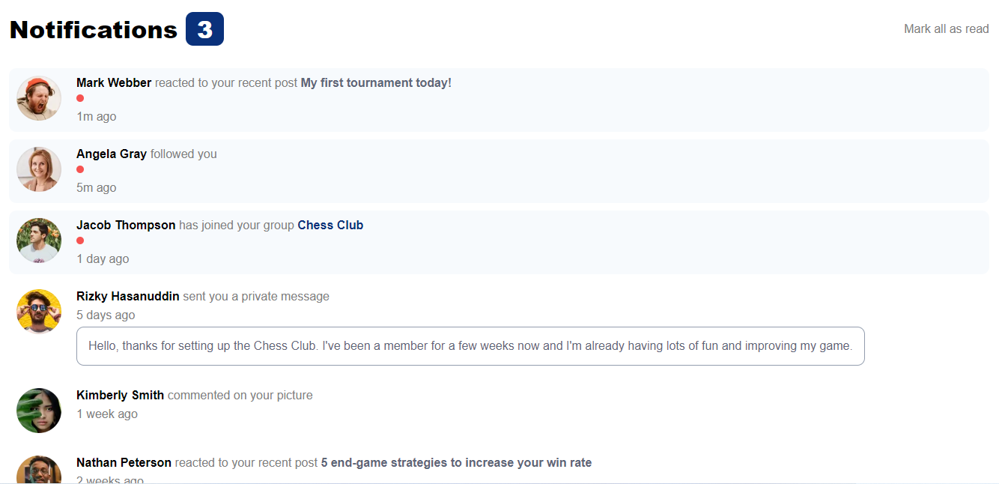

# Frontend Mentor - Notifications page solution

This is a solution to the [Notifications page challenge on Frontend Mentor](https://www.frontendmentor.io/challenges/notifications-page-DqK5QAmKbC). Frontend Mentor challenges help you improve your coding skills by building realistic projects. 

## Table of contents

- [Overview](#overview)
  - [The challenge](#the-challenge)
  - [Screenshot](#screenshot)
  - [Links](#links)
- [My process](#my-process)
  - [Built with](#built-with)
  - [What I learned](#what-i-learned)
  - [Continued development](#continued-development)
  - [Useful resources](#useful-resources)
- [Author](#author)

## Overview

### The challenge

Users should be able to:

- Distinguish between "unread" and "read" notifications
- Select "Mark all as read" to toggle the visual state of the unread notifications and set the number of unread messages to zero
- View the optimal layout for the interface depending on their device's screen size
- See hover and focus states for all interactive elements on the page

### Screenshot

### Links

- Live Site URL: [https://delmondes200019.github.io/notifications-page-main/](https://delmondes200019.github.io/notifications-page-main/)

## My process

### Built with

- Semantic HTML5 markup
- CSS
- Flexbox
- Mobile-first workflow

### What I learned

In this challenge i've learned how to build a simple and interactive notifications UI with basic HTML5, CSS e JS knowledgments.   

### Continued development

I'm not completely comfortable with building UIs, so for continued development i'll continue to study HTML and CSS and do more challenges like this one to refine and perfect my habilities on bulding UIs

### Useful resources

- [CSS-Tricks](https://css-tricks.com/snippets/css/a-guide-to-flexbox/) - This helped me with CSS Flexbox. I'll continue to use it  and i'd recommend it to anyone still learning this concept

## Author

- Website - [Vitor Delmondes Araujo](https://delmondes-profile.herokuapp.com/)
- Frontend Mentor - [@Delmondes200019](https://www.frontendmentor.io/profile/Delmondes200019)
